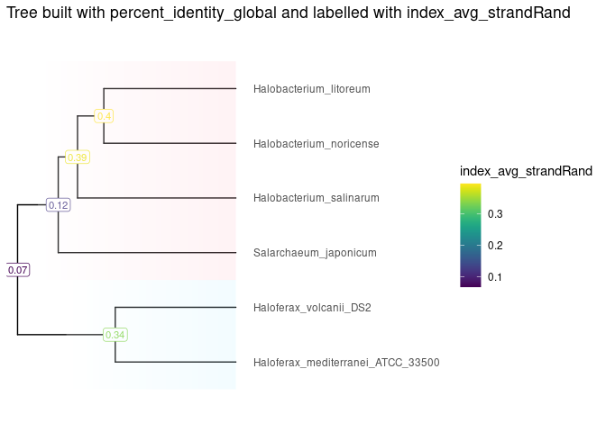
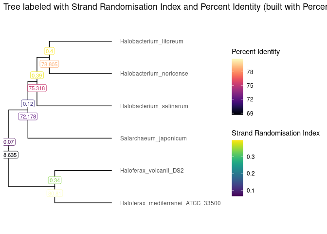

<!-- README.md is generated from README.Rmd. Please edit that file -->

# ScrambledTreeBuilder

<!-- badges: start -->
<!-- badges: end -->

The goal of ScrambledTreeBuilder is to allow users to conveniently
produce phylogenetic trees between species with the purpose of studying
genome scrambling.

## Installation

You can install the development version of ScrambledTreeBuilder from
[GitHub](https://github.com/) with:

``` r
# install.packages("devtools")
devtools::install_github("brennern/ScrambledTreeBuilder")
#> Downloading GitHub repo brennern/ScrambledTreeBuilder@HEAD
#> labeling    (0.4.2   -> 0.4.3  ) [CRAN]
#> gtable      (0.3.3   -> 0.3.4  ) [CRAN]
#> xml2        (1.3.4   -> 1.3.5  ) [CRAN]
#> curl        (5.0.1   -> 5.0.2  ) [CRAN]
#> xfun        (0.39    -> 0.40   ) [CRAN]
#> tinytex     (0.45    -> 0.46   ) [CRAN]
#> fontawesome (0.5.1   -> 0.5.2  ) [CRAN]
#> bslib       (0.5.0   -> 0.5.1  ) [CRAN]
#> rmarkdown   (2.23    -> 2.24   ) [CRAN]
#> htmltools   (0.5.5   -> 0.5.6  ) [CRAN]
#> askpass     (1.1     -> 1.2.0  ) [CRAN]
#> httr        (1.4.6   -> 1.4.7  ) [CRAN]
#> promises    (1.2.0.1 -> 1.2.1  ) [CRAN]
#> shiny       (1.7.4   -> 1.7.5  ) [CRAN]
#> gert        (1.9.2   -> 1.9.3  ) [CRAN]
#> dplyr       (1.1.2   -> 1.1.3  ) [CRAN]
#> remotes     (2.4.2   -> 2.4.2.1) [CRAN]
#> yulab.utils (0.0.7   -> 0.0.9  ) [CRAN]
#> Skipping 1 packages not available: ggtree
#> Installing 18 packages: labeling, gtable, xml2, curl, xfun, tinytex, fontawesome, bslib, rmarkdown, htmltools, askpass, httr, promises, shiny, gert, dplyr, remotes, yulab.utils
#> Installing packages into '/tmp/Rtmp1kYICh/temp_libpath298411fb87d8e'
#> (as 'lib' is unspecified)
#> ── R CMD build ─────────────────────────────────────────────────────────────────
#> * checking for file ‘/tmp/Rtmpmf2RG3/remotes2f735bfbb722/brennern-ScrambledTreeBuilder-1b11b71/DESCRIPTION’ ... OK
#> * preparing ‘ScrambledTreeBuilder’:
#> * checking DESCRIPTION meta-information ... OK
#> * checking for LF line-endings in source and make files and shell scripts
#> * checking for empty or unneeded directories
#> * building ‘ScrambledTreeBuilder_0.0.0.9000.tar.gz’
#> Warning in utils::tar(filepath, pkgname, compression = compression, compression_level = 9L,  :
#>   storing paths of more than 100 bytes is not portable:
#>   ‘ScrambledTreeBuilder/inst/extdata/PairwiseComparisons/Halobacterium_litoreum___Halobacterium_noricense.yaml.bz2’
#> Warning in utils::tar(filepath, pkgname, compression = compression, compression_level = 9L,  :
#>   storing paths of more than 100 bytes is not portable:
#>   ‘ScrambledTreeBuilder/inst/extdata/PairwiseComparisons/Halobacterium_litoreum___Halobacterium_salinarum.yaml.bz2’
#> Warning in utils::tar(filepath, pkgname, compression = compression, compression_level = 9L,  :
#>   storing paths of more than 100 bytes is not portable:
#>   ‘ScrambledTreeBuilder/inst/extdata/PairwiseComparisons/Halobacterium_litoreum___Haloferax_mediterranei_ATCC_33500.yaml.bz2’
#> Warning in utils::tar(filepath, pkgname, compression = compression, compression_level = 9L,  :
#>   storing paths of more than 100 bytes is not portable:
#>   ‘ScrambledTreeBuilder/inst/extdata/PairwiseComparisons/Halobacterium_litoreum___Haloferax_volcanii_DS2.yaml.bz2’
#> Warning in utils::tar(filepath, pkgname, compression = compression, compression_level = 9L,  :
#>   storing paths of more than 100 bytes is not portable:
#>   ‘ScrambledTreeBuilder/inst/extdata/PairwiseComparisons/Halobacterium_litoreum___Salarchaeum_japonicum.yaml.bz2’
#> Warning in utils::tar(filepath, pkgname, compression = compression, compression_level = 9L,  :
#>   storing paths of more than 100 bytes is not portable:
#>   ‘ScrambledTreeBuilder/inst/extdata/PairwiseComparisons/Halobacterium_noricense___Halobacterium_litoreum.yaml.bz2’
#> Warning in utils::tar(filepath, pkgname, compression = compression, compression_level = 9L,  :
#>   storing paths of more than 100 bytes is not portable:
#>   ‘ScrambledTreeBuilder/inst/extdata/PairwiseComparisons/Halobacterium_noricense___Halobacterium_salinarum.yaml.bz2’
#> Warning in utils::tar(filepath, pkgname, compression = compression, compression_level = 9L,  :
#>   storing paths of more than 100 bytes is not portable:
#>   ‘ScrambledTreeBuilder/inst/extdata/PairwiseComparisons/Halobacterium_noricense___Haloferax_mediterranei_ATCC_33500.yaml.bz2’
#> Warning in utils::tar(filepath, pkgname, compression = compression, compression_level = 9L,  :
#>   storing paths of more than 100 bytes is not portable:
#>   ‘ScrambledTreeBuilder/inst/extdata/PairwiseComparisons/Halobacterium_noricense___Haloferax_volcanii_DS2.yaml.bz2’
#> Warning in utils::tar(filepath, pkgname, compression = compression, compression_level = 9L,  :
#>   storing paths of more than 100 bytes is not portable:
#>   ‘ScrambledTreeBuilder/inst/extdata/PairwiseComparisons/Halobacterium_noricense___Salarchaeum_japonicum.yaml.bz2’
#> Warning in utils::tar(filepath, pkgname, compression = compression, compression_level = 9L,  :
#>   storing paths of more than 100 bytes is not portable:
#>   ‘ScrambledTreeBuilder/inst/extdata/PairwiseComparisons/Halobacterium_salinarum___Halobacterium_litoreum.yaml.bz2’
#> Warning in utils::tar(filepath, pkgname, compression = compression, compression_level = 9L,  :
#>   storing paths of more than 100 bytes is not portable:
#>   ‘ScrambledTreeBuilder/inst/extdata/PairwiseComparisons/Halobacterium_salinarum___Halobacterium_noricense.yaml.bz2’
#> Warning in utils::tar(filepath, pkgname, compression = compression, compression_level = 9L,  :
#>   storing paths of more than 100 bytes is not portable:
#>   ‘ScrambledTreeBuilder/inst/extdata/PairwiseComparisons/Halobacterium_salinarum___Haloferax_mediterranei_ATCC_33500.yaml.bz2’
#> Warning in utils::tar(filepath, pkgname, compression = compression, compression_level = 9L,  :
#>   storing paths of more than 100 bytes is not portable:
#>   ‘ScrambledTreeBuilder/inst/extdata/PairwiseComparisons/Halobacterium_salinarum___Haloferax_volcanii_DS2.yaml.bz2’
#> Warning in utils::tar(filepath, pkgname, compression = compression, compression_level = 9L,  :
#>   storing paths of more than 100 bytes is not portable:
#>   ‘ScrambledTreeBuilder/inst/extdata/PairwiseComparisons/Halobacterium_salinarum___Salarchaeum_japonicum.yaml.bz2’
#> Warning in utils::tar(filepath, pkgname, compression = compression, compression_level = 9L,  :
#>   storing paths of more than 100 bytes is not portable:
#>   ‘ScrambledTreeBuilder/inst/extdata/PairwiseComparisons/Haloferax_mediterranei_ATCC_33500___Halobacterium_litoreum.yaml.bz2’
#> Warning in utils::tar(filepath, pkgname, compression = compression, compression_level = 9L,  :
#>   storing paths of more than 100 bytes is not portable:
#>   ‘ScrambledTreeBuilder/inst/extdata/PairwiseComparisons/Haloferax_mediterranei_ATCC_33500___Halobacterium_noricense.yaml.bz2’
#> Warning in utils::tar(filepath, pkgname, compression = compression, compression_level = 9L,  :
#>   storing paths of more than 100 bytes is not portable:
#>   ‘ScrambledTreeBuilder/inst/extdata/PairwiseComparisons/Haloferax_mediterranei_ATCC_33500___Halobacterium_salinarum.yaml.bz2’
#> Warning in utils::tar(filepath, pkgname, compression = compression, compression_level = 9L,  :
#>   storing paths of more than 100 bytes is not portable:
#>   ‘ScrambledTreeBuilder/inst/extdata/PairwiseComparisons/Haloferax_mediterranei_ATCC_33500___Haloferax_volcanii_DS2.yaml.bz2’
#> Warning in utils::tar(filepath, pkgname, compression = compression, compression_level = 9L,  :
#>   storing paths of more than 100 bytes is not portable:
#>   ‘ScrambledTreeBuilder/inst/extdata/PairwiseComparisons/Haloferax_mediterranei_ATCC_33500___Salarchaeum_japonicum.yaml.bz2’
#> Warning in utils::tar(filepath, pkgname, compression = compression, compression_level = 9L,  :
#>   storing paths of more than 100 bytes is not portable:
#>   ‘ScrambledTreeBuilder/inst/extdata/PairwiseComparisons/Haloferax_volcanii_DS2___Halobacterium_litoreum.yaml.bz2’
#> Warning in utils::tar(filepath, pkgname, compression = compression, compression_level = 9L,  :
#>   storing paths of more than 100 bytes is not portable:
#>   ‘ScrambledTreeBuilder/inst/extdata/PairwiseComparisons/Haloferax_volcanii_DS2___Halobacterium_noricense.yaml.bz2’
#> Warning in utils::tar(filepath, pkgname, compression = compression, compression_level = 9L,  :
#>   storing paths of more than 100 bytes is not portable:
#>   ‘ScrambledTreeBuilder/inst/extdata/PairwiseComparisons/Haloferax_volcanii_DS2___Halobacterium_salinarum.yaml.bz2’
#> Warning in utils::tar(filepath, pkgname, compression = compression, compression_level = 9L,  :
#>   storing paths of more than 100 bytes is not portable:
#>   ‘ScrambledTreeBuilder/inst/extdata/PairwiseComparisons/Haloferax_volcanii_DS2___Haloferax_mediterranei_ATCC_33500.yaml.bz2’
#> Warning in utils::tar(filepath, pkgname, compression = compression, compression_level = 9L,  :
#>   storing paths of more than 100 bytes is not portable:
#>   ‘ScrambledTreeBuilder/inst/extdata/PairwiseComparisons/Haloferax_volcanii_DS2___Salarchaeum_japonicum.yaml.bz2’
#> Warning in utils::tar(filepath, pkgname, compression = compression, compression_level = 9L,  :
#>   storing paths of more than 100 bytes is not portable:
#>   ‘ScrambledTreeBuilder/inst/extdata/PairwiseComparisons/Salarchaeum_japonicum___Halobacterium_litoreum.yaml.bz2’
#> Warning in utils::tar(filepath, pkgname, compression = compression, compression_level = 9L,  :
#>   storing paths of more than 100 bytes is not portable:
#>   ‘ScrambledTreeBuilder/inst/extdata/PairwiseComparisons/Salarchaeum_japonicum___Halobacterium_noricense.yaml.bz2’
#> Warning in utils::tar(filepath, pkgname, compression = compression, compression_level = 9L,  :
#>   storing paths of more than 100 bytes is not portable:
#>   ‘ScrambledTreeBuilder/inst/extdata/PairwiseComparisons/Salarchaeum_japonicum___Halobacterium_salinarum.yaml.bz2’
#> Warning in utils::tar(filepath, pkgname, compression = compression, compression_level = 9L,  :
#>   storing paths of more than 100 bytes is not portable:
#>   ‘ScrambledTreeBuilder/inst/extdata/PairwiseComparisons/Salarchaeum_japonicum___Haloferax_mediterranei_ATCC_33500.yaml.bz2’
#> Warning in utils::tar(filepath, pkgname, compression = compression, compression_level = 9L,  :
#>   storing paths of more than 100 bytes is not portable:
#>   ‘ScrambledTreeBuilder/inst/extdata/PairwiseComparisons/Salarchaeum_japonicum___Haloferax_volcanii_DS2.yaml.bz2’
#> Installing package into '/tmp/Rtmp1kYICh/temp_libpath298411fb87d8e'
#> (as 'lib' is unspecified)
```

## Usage

After performing an All Vs. All genome comparison between dozens of
species, you may have .yaml files as the output. In order to convert
these files into a dataframe in R, you may use the `formatStats()`
function. Extract your .yaml files from their respective directory and
store the information under the variable `yamlFiles`.

``` r
library(ScrambledTreeBuilder)

resultsDir <- system.file("extdata/PairwiseComparisons", package = "ScrambledTreeBuilder")
yamlFileData <- list.files(resultsDir, pattern = "*.yaml.bz2", full.names = TRUE)
names(yamlFileData) <- yamlFileData |> basename() |> sub(pat = ".yaml.bz2", rep="")

exDataFrame <- formatStats(yamlFileData)
```

To build the phylogenetic trees, your data frame will need to be
transformed into a matrix. The function `makeMatrix()` will accomplish
this.

``` r
valuesToBuildTheTree <- "percent_identity_global"
treeMatrix <- makeMatrix(exDataFrame, valuesToBuildTheTree, 100, 50)
valuesToPlaceOnLabels <- "index_avg_strandRand"
valueMatrix <- makeMatrix(exDataFrame, valuesToPlaceOnLabels, 1, 0.5)
```

Then, in order to plot the percent identity and strand randomisation
index scores on the tree, you will need to extract the tree data in a
tibble and utilize the functions `makeValueTibble()`.

``` r
HClust <- hclust(dist(treeMatrix), method = "complete")
Tibble <- tidytree::as_tibble(tidytree::as.phylo(HClust))
tibbleWithValue <- makeValueTibble(Tibble, valueMatrix)
tibbleWithMultipleValues <- makeMultiValueTibble(Tibble, exDataFrame, colsToSelect = c("index_avg_strandRand", "percent_identity_global"))
```

Finally, to visualize your phylogenetic tree, you can utilize the
`visualizeTree()` function by inputting your tibble data containing your
desired variable.

``` r
SingleValueTree <- visualizeTree(tibbleWithValue, tibbleWithValue$value)
#> Registered S3 methods overwritten by 'treeio':
#>   method              from    
#>   MRCA.phylo          tidytree
#>   MRCA.treedata       tidytree
#>   Nnode.treedata      tidytree
#>   Ntip.treedata       tidytree
#>   ancestor.phylo      tidytree
#>   ancestor.treedata   tidytree
#>   child.phylo         tidytree
#>   child.treedata      tidytree
#>   full_join.phylo     tidytree
#>   full_join.treedata  tidytree
#>   groupClade.phylo    tidytree
#>   groupClade.treedata tidytree
#>   groupOTU.phylo      tidytree
#>   groupOTU.treedata   tidytree
#>   inner_join.phylo    tidytree
#>   inner_join.treedata tidytree
#>   is.rooted.treedata  tidytree
#>   nodeid.phylo        tidytree
#>   nodeid.treedata     tidytree
#>   nodelab.phylo       tidytree
#>   nodelab.treedata    tidytree
#>   offspring.phylo     tidytree
#>   offspring.treedata  tidytree
#>   parent.phylo        tidytree
#>   parent.treedata     tidytree
#>   root.treedata       tidytree
#>   rootnode.phylo      tidytree
#>   sibling.phylo       tidytree
#> Scale for y is already present.
#> Adding another scale for y, which will replace the existing scale.

SingleValueTree + 
  ggplot2::ggtitle(paste("Tree built with", valuesToBuildTheTree, "and labelled with", valuesToPlaceOnLabels)) + 
  viridis::scale_color_viridis(name = valuesToPlaceOnLabels) +
  ggtree::geom_hilight(node = 8, fill = "lightblue1", alpha = .2, type = "gradient", gradient.direction = 'tr') +
  ggtree::geom_hilight(node = 9, fill = "pink", alpha = .2, type = "gradient", gradient.direction = 'tr')
```



``` r
MultiValueTree <- visualizeTree(tibbleWithMultipleValues, tibbleWithMultipleValues$index_avg_strandRand, ynudge = 0.35)
#> Scale for y is already present.
#> Adding another scale for y, which will replace the existing scale.

MultiValueTree +
  ggplot2::ggtitle("Tree labeled with strand randomisation index and percent identity (built with percent identity)") +
  viridis::scale_color_viridis(name = "Strand Randomisation Index") +
  ggnewscale::new_scale_colour() +
  ggtree::geom_label(ggtree::aes(label=round(percent_identity_global, digits = 3), color = percent_identity_global), label.size = 0.25, size = 3, na.rm = TRUE, label.padding = ggtree::unit(0.15, "lines"), nudge_y = -0.35) +
  viridis::scale_color_viridis(option = "magma", name = "Percent Identity")
```


