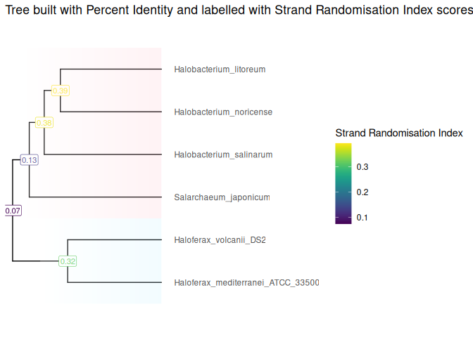

<!-- README.md is generated from README.Rmd. Please edit that file -->

# ScrambledTreeBuilder

<!-- badges: start -->

<!-- badges: end -->

Produce, plot and use phylogenetic trees to study genome scrambling.

## Installation

As of today there is no release. Install the development version of
*ScrambledTreeBuilder* from
[GitHub](https://github.com/brennern/ScrambledTreeBuilder/) with:

    # install.packages("devtools")
    remotes::install_github("brennern/ScrambledTreeBuilder", repos=BiocManager::repositories())

## Usage

The input of *ScrambledTreeBuilder* is YAML files produced by the
[oist/plessy_nf_GenomicBreaks](https://github.com/oist/plessy_nf_GenomicBreaks)
pipeline from all-versus-all pairwise genome alignments computed with
the (nf-core/pairgenomealign)\[<https://nf-co.re/pairgenomealign>\]
pipeline. This package includes a few YAML files in its example data,
and example objects derived from these files to compute and plot trees.
Here is an example of tree produced by *ScrambledTreeBuilder*. See the
[Get started](articles/ScrambledTreeBuilder.html) vignette for details.

``` r
library(ScrambledTreeBuilder)
#> Loading required package: S7
visualizeTree(Halo_Tree, "Scrambling_index") +
  Halo_FocalClades +
  ggplot2::ggtitle(paste("Tree built with Percent difference and labelled with Scrambling index")) + 
  viridis::scale_color_viridis(name = "Scambling index")
```


