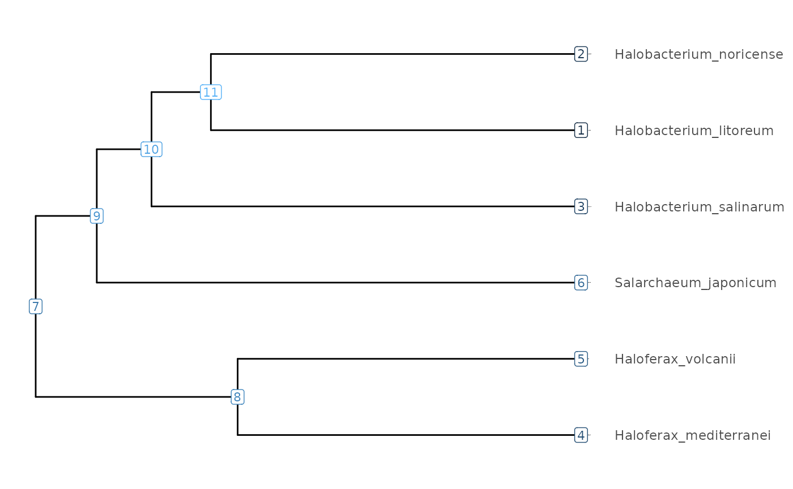
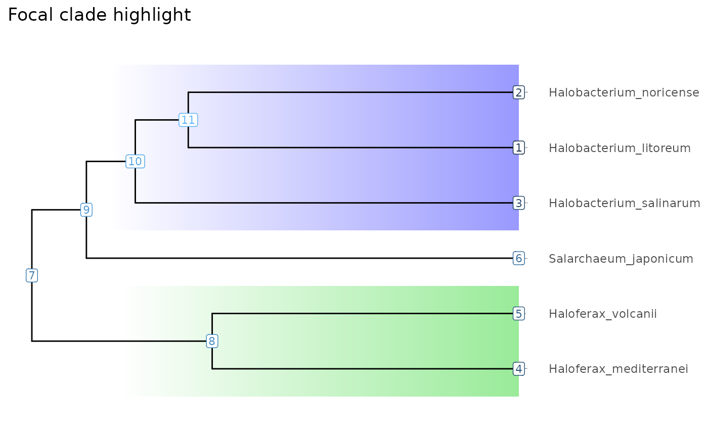
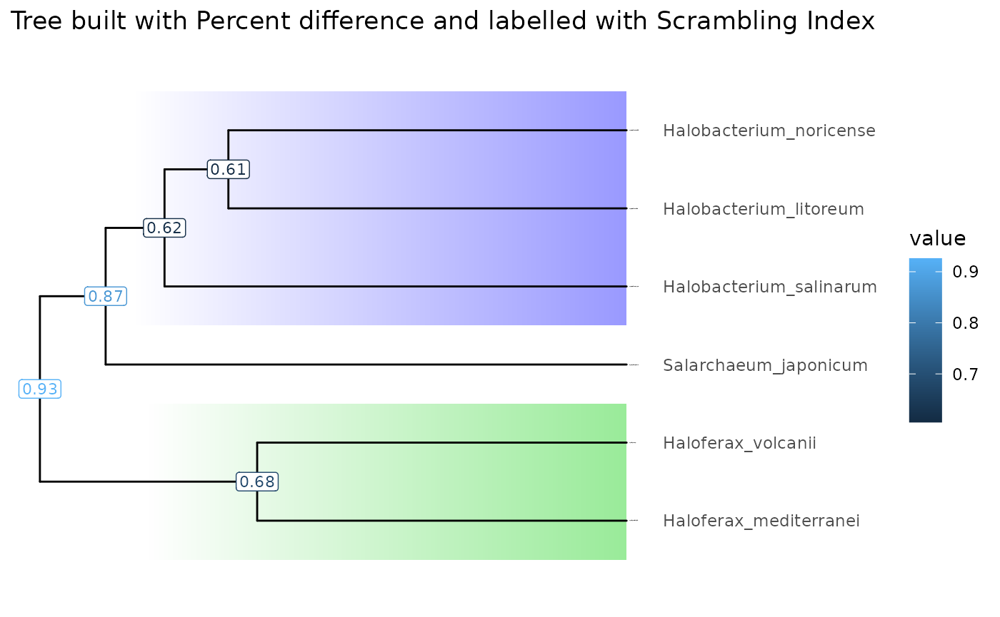
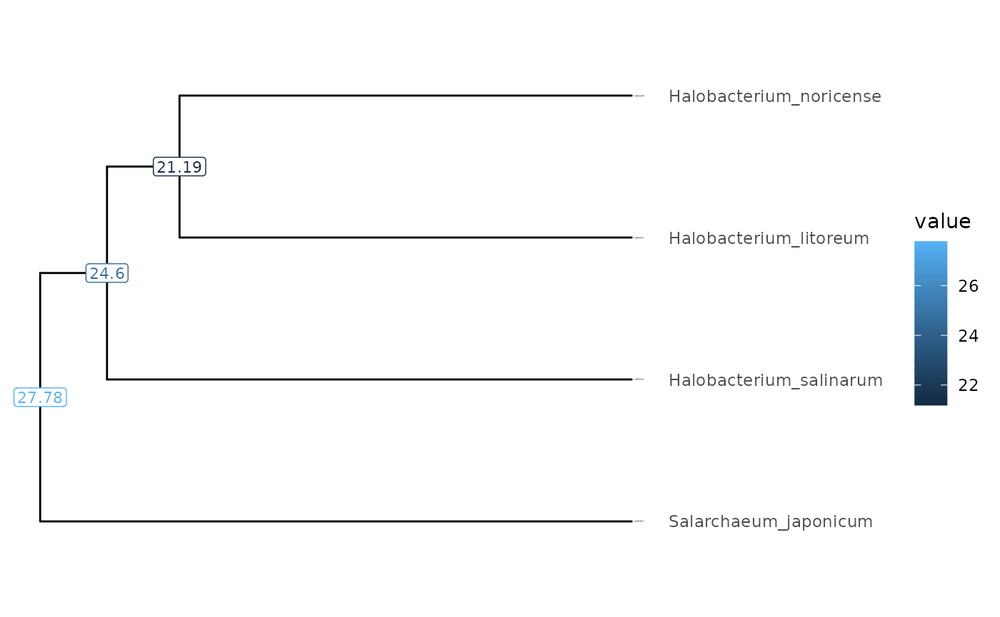

# ScrambledTreeBuilder

``` r
knitr::opts_chunk$set(cache = FALSE)
knitr::opts_knit$set(verbose = TRUE)
```

## Introduction

The *ScrambledTreeBuilder* package consists of numerous data formatting
functions for phylogenetic tree building in the context of the (still
internal) [Scrambling in the Tree of
Life](https://github.com/oist/LuscombeU_ScramblingInTheTreeOfLife)
project.

## Load Package

The *ScrambledTreeBuilder* package outputs plots in *ggplot2* format but
you need to load the *ggplot2* package to further customize them.

``` r
library(ScrambledTreeBuilder) |> suppressPackageStartupMessages()
library(ggplot2)              |> suppressPackageStartupMessages()
```

## Example Data

This package utilizes example YAML files containing summary statistics
of halobacteria genome comparison data. In regards to genome scrambling,
many studies have showcased significant genome rearrangements in such
halobacteria species due to dozens of insertion sequence families.

The YAML summary files are produced by performing an all vs. all genome
comparison between six halobacteria species using the [nf-core pairwise
genome alignment pipeline](https://nf-co.re/pairgenomealign/) and an
[post-processing
pipeline](https://github.com/oist/plessy_nf_GenomicBreaks) running
functions from the
[GenomicBreaks](https://github.com/oist/GenomicBreaks) package to
extract statistics on alignment length and the extent of genome
scrambling. Examples YAML files are stored in `extdata/yaml`. Each file
represent one pairwise alignment, and the file names conveys the
identifiers of the *target* and *query* genomes (here species names)
separed with three underscores (`___`).

Here we prepare an object called ‘yamlFileData’ that contains the path
to the files.

``` r
yamlFileData <- system.file("extdata/yaml", package = "ScrambledTreeBuilder") |>
  resultFiles()
yamlFileData[1]
#>                                                                              Halobacterium_litoreum___Halobacterium_noricense 
#> "/home/runner/work/_temp/Library/ScrambledTreeBuilder/extdata/yaml/Halobacterium_litoreum___Halobacterium_noricense.yaml.bz2"
```

Next, we use the
[`formatStats()`](https://brennern.github.io/ScrambledTreeBuilder/reference/formatStats.md)
function to load the YAML files into a single dataframe where each line
is a pair of species and each column is a statistic or a metadata about
that species comparison.

``` r
exDataFrame <- formatStats(yamlFileData)
ncol(exDataFrame)
#> [1] 236
colnames(exDataFrame) |> head()
#> [1] "aligned_length_Min"    "aligned_length_Q1"     "aligned_length_Median"
#> [4] "aligned_length_Mean"   "aligned_length_Q3"     "aligned_length_Max"
colnames(exDataFrame) |> grep(pat = "_Mean", value = TRUE) |> head()
#> [1] "aligned_length_Mean"      "aligned_score_Mean"      
#> [3] "aligned_matches_Mean"     "aligned_mismatches_Mean" 
#> [5] "aligned_gaps_target_Mean" "aligned_gaps_query_Mean"
colnames(exDataFrame) |> tail()
#> [1] "percent_identity_global"   "percent_difference_local" 
#> [3] "percent_difference_global" "index_avg_strandDiscord"  
#> [5] "percent_aligned"           "lab"
```

This data frame has a large number of columns, providing summary
statistics on various aspects of the alignments. For statistics of
interest, we build square matrices where rows and columns indicate one
species, and the cells at each intersection contain the value for that
pair.

We perform this task with the
[`makeMatrix()`](https://brennern.github.io/ScrambledTreeBuilder/reference/makeMatrix.md)
function. It provide defaults for missing values and self-comparisons.
In this vignette, let’s focus on the percent nucleotide difference and
the scrambling index.

``` r
# Percent nucleotide difference  We will use it to cluster a tree.
treeMatrix <- 100 - makeMatrix(exDataFrame, "percent_identity_global", 100, 50)
round(treeMatrix)
#>                         Halobacterium_litoreum Halobacterium_noricense
#> Halobacterium_litoreum                       0                      21
#> Halobacterium_noricense                     21                       0
#> Halobacterium_salinarum                     24                      25
#> Haloferax_mediterranei                      32                      34
#> Haloferax_volcanii                          30                      30
#> Salarchaeum_japonicum                       27                      28
#>                         Halobacterium_salinarum Haloferax_mediterranei
#> Halobacterium_litoreum                       24                     31
#> Halobacterium_noricense                      25                     32
#> Halobacterium_salinarum                       0                     33
#> Haloferax_mediterranei                       33                      0
#> Haloferax_volcanii                           32                     20
#> Salarchaeum_japonicum                        28                     31
#>                         Haloferax_volcanii Salarchaeum_japonicum
#> Halobacterium_litoreum                  30                    27
#> Halobacterium_noricense                 30                    28
#> Halobacterium_salinarum                 32                    28
#> Haloferax_mediterranei                  20                    32
#> Haloferax_volcanii                       0                    30
#> Salarchaeum_japonicum                   30                     0
#> attr(,"builtWith")
#> [1] "percent_identity_global"
```

``` r
# Scrambling index
valueMatrix <- 1 - makeMatrix(exDataFrame, "index_avg_strandRand", 1, 0.5)
round(valueMatrix, 2)
#>                         Halobacterium_litoreum Halobacterium_noricense
#> Halobacterium_litoreum                    0.00                    0.61
#> Halobacterium_noricense                   0.61                    0.00
#> Halobacterium_salinarum                   0.47                    0.77
#> Haloferax_mediterranei                    0.92                    0.93
#> Haloferax_volcanii                        0.94                    0.95
#> Salarchaeum_japonicum                     0.82                    0.87
#>                         Halobacterium_salinarum Haloferax_mediterranei
#> Halobacterium_litoreum                     0.47                   0.92
#> Halobacterium_noricense                    0.77                   0.93
#> Halobacterium_salinarum                    0.00                   0.93
#> Haloferax_mediterranei                     0.93                   0.00
#> Haloferax_volcanii                         0.87                   0.68
#> Salarchaeum_japonicum                      0.92                   0.89
#>                         Haloferax_volcanii Salarchaeum_japonicum
#> Halobacterium_litoreum                0.94                  0.81
#> Halobacterium_noricense               0.95                  0.87
#> Halobacterium_salinarum               0.88                  0.92
#> Haloferax_mediterranei                0.68                  0.89
#> Haloferax_volcanii                    0.00                  0.99
#> Salarchaeum_japonicum                 0.99                  0.00
#> attr(,"builtWith")
#> [1] "index_avg_strandRand"
```

## Tree clustering

We cluster the percent nucleotide difference matrix (`treeMatrix`) to
produce a tree in *tibble* format, using the
[`makeTidyTree()`](https://brennern.github.io/ScrambledTreeBuilder/reference/makeTidyTree.md)
function.

``` r
# Let's average the target-query and query-target replicate pairs.
(Tibble <- makeTidyTree((treeMatrix/2 + t(treeMatrix)/2)))
#> # A tbl_tree abstraction: 11 × 7
#> # which can be converted to treedata or phylo 
#> # via as.treedata or as.phylo
#>    parent  node branch.length label                   isTip     y bootstrap
#>     <int> <int>         <dbl> <chr>                   <lgl> <dbl>     <dbl>
#>  1     11     1         10.6  Halobacterium_litoreum  TRUE   5           NA
#>  2     11     2         10.6  Halobacterium_noricense TRUE   6           NA
#>  3     10     3         12.3  Halobacterium_salinarum TRUE   4           NA
#>  4      8     4          9.85 Haloferax_mediterranei  TRUE   1           NA
#>  5      8     5          9.85 Haloferax_volcanii      TRUE   2           NA
#>  6      9     6         13.9  Salarchaeum_japonicum   TRUE   3           NA
#>  7      7     7         NA    NA                      FALSE  2.69        NA
#>  8      7     8          5.79 NA                      FALSE  1.5         NA
#>  9      7     9          1.75 NA                      FALSE  3.88        NA
#> 10      9    10          1.57 NA                      FALSE  4.75        NA
#> 11     10    11          1.70 NA                      FALSE  5.5         NA
```

``` r
visualizeTree(Tibble)
```



The node IDs can be used to manipulate the tree, for instance subsetting
with the `subtree()` function.

``` r
visualizeTree(Tibble |> subTree(9))
```


## Focal clades

Clades of interest, which we call *focal clades* (焦点系統群) can be
tracked and highlighted by `FocalClade` objects. For robustness against
changes in the input data or clustering approach, it is recommented to
define a clade by the most recent common ancestor from a pair of
species. The
[`subTree()`](https://brennern.github.io/ScrambledTreeBuilder/reference/subTree.md)
function can take `FocalClade` objects instead of node IDs as input.

``` r
(Halobacterium <- focalClade(Tibble, "Halobacterium_noricense", "Halobacterium_salinarum", "blue", "Halobacterium genus"))
#> Halobacterium genus, node ID: 10, number of genomes: 3
Halobacterium@genomeIDs
#> [1] "Halobacterium_litoreum"  "Halobacterium_noricense"
#> [3] "Halobacterium_salinarum"
Halobacterium@nodeID
#> [1] 10
subTree(Tibble, Halobacterium)
#> # A tbl_tree abstraction: 5 × 9
#> # which can be converted to treedata or phylo 
#> # via as.treedata or as.phylo
#>   parent  node branch.length label         group bootstrap node.orig isTip     y
#>    <int> <int>         <dbl> <chr>         <fct>     <dbl>     <int> <lgl> <dbl>
#> 1      5     1         10.6  Halobacteriu… 1            NA         1 TRUE   2   
#> 2      5     2         10.6  Halobacteriu… 1            NA         2 TRUE   3   
#> 3      4     3         12.3  Halobacteriu… 1            NA         3 TRUE   1   
#> 4      4     4          3.32 NA            1            NA        10 FALSE  1.75
#> 5      4     5          1.70 NA            1            NA        11 FALSE  2.5
```

The focal clade objects can be added to plots to highlight the clades in
the selected colors.

``` r
Haloferax <- focalClade(Tibble, "Haloferax_mediterranei", "Haloferax_volcanii", "green3", "Haloferax genus")
(clades <- FocalCladeList(Halobacterium=Halobacterium, Haloferax=Haloferax))
#> Halobacterium genus, node ID: 10, number of genomes: 3
#> Haloferax genus, node ID: 8, number of genomes: 2
visualizeTree(Tibble) + clades + ggtitle("Focal clade highlight")
```



## Heatmaps

To further quality control the tree and its genomes, it is possible to
plot the values from the distance matrices as a heatmap in which rows
and columns are in the same order as the branches of the tree. Focal
clades can be highlighted too.

``` r
treeHeatMap(treeMatrix,  Tibble, clades, main = "Percent difference")
```


``` r
treeHeatMap(valueMatrix, Tibble, clades, main = "Scrambling index")
```


## Projecton on most recent common ancestors

To plot more data on the tree, we add other statistics to the tree
object, here the scrambling index and the percent nucleotide difference,
using the
[`makeValueTibble()`](https://brennern.github.io/ScrambledTreeBuilder/reference/makeValueTibble.md)
function. This operation reduces a pairwise matrix to the tree, by
averaging all the pairs sharing the same most recent common ancestor,
represented by an internal node in the tree.

``` r
(tibbleWithValues <- makeValueTibble(Tibble, valueMatrix, colname = "Scrambling_index"))
#> # A tbl_tree abstraction: 11 × 8
#> # which can be converted to treedata or phylo 
#> # via as.treedata or as.phylo
#>    parent  node branch.length label       isTip     y bootstrap Scrambling_index
#>     <int> <int>         <dbl> <chr>       <lgl> <dbl>     <dbl>            <dbl>
#>  1     11     1         10.6  Halobacter… TRUE   5           NA           NA    
#>  2     11     2         10.6  Halobacter… TRUE   6           NA           NA    
#>  3     10     3         12.3  Halobacter… TRUE   4           NA           NA    
#>  4      8     4          9.85 Haloferax_… TRUE   1           NA           NA    
#>  5      8     5          9.85 Haloferax_… TRUE   2           NA           NA    
#>  6      9     6         13.9  Salarchaeu… TRUE   3           NA           NA    
#>  7      7     7         NA    NA          FALSE  2.69        NA            0.926
#>  8      7     8          5.79 NA          FALSE  1.5         NA            0.683
#>  9      7     9          1.75 NA          FALSE  3.88        NA            0.869
#> 10      9    10          1.57 NA          FALSE  4.75        NA            0.618
#> 11     10    11          1.70 NA          FALSE  5.5         NA            0.605
```

``` r
(tibbleWithMultipleValues <- makeValueTibble(tibbleWithValues, treeMatrix, colname = "Percent_difference"))
#> # A tbl_tree abstraction: 11 × 9
#> # which can be converted to treedata or phylo 
#> # via as.treedata or as.phylo
#>    parent  node branch.length label       isTip     y bootstrap Scrambling_index
#>     <int> <int>         <dbl> <chr>       <lgl> <dbl>     <dbl>            <dbl>
#>  1     11     1         10.6  Halobacter… TRUE   5           NA           NA    
#>  2     11     2         10.6  Halobacter… TRUE   6           NA           NA    
#>  3     10     3         12.3  Halobacter… TRUE   4           NA           NA    
#>  4      8     4          9.85 Haloferax_… TRUE   1           NA           NA    
#>  5      8     5          9.85 Haloferax_… TRUE   2           NA           NA    
#>  6      9     6         13.9  Salarchaeu… TRUE   3           NA           NA    
#>  7      7     7         NA    NA          FALSE  2.69        NA            0.926
#>  8      7     8          5.79 NA          FALSE  1.5         NA            0.683
#>  9      7     9          1.75 NA          FALSE  3.88        NA            0.869
#> 10      9    10          1.57 NA          FALSE  4.75        NA            0.618
#> 11     10    11          1.70 NA          FALSE  5.5         NA            0.605
#> # ℹ 1 more variable: Percent_difference <dbl>
```

We made multiple tables to show the step-by-step process, but typically
one would just keep the last table. This can be done with pipes.

``` r
makeTidyTree((treeMatrix/2 + t(treeMatrix)/2)) |>
  makeValueTibble(valueMatrix, colname = "Scrambling_index") |>
  makeValueTibble(treeMatrix,  colname = "Percent_difference")
#> # A tbl_tree abstraction: 11 × 9
#> # which can be converted to treedata or phylo 
#> # via as.treedata or as.phylo
#>    parent  node branch.length label       isTip     y bootstrap Scrambling_index
#>     <int> <int>         <dbl> <chr>       <lgl> <dbl>     <dbl>            <dbl>
#>  1     11     1         10.6  Halobacter… TRUE   5           NA           NA    
#>  2     11     2         10.6  Halobacter… TRUE   6           NA           NA    
#>  3     10     3         12.3  Halobacter… TRUE   4           NA           NA    
#>  4      8     4          9.85 Haloferax_… TRUE   1           NA           NA    
#>  5      8     5          9.85 Haloferax_… TRUE   2           NA           NA    
#>  6      9     6         13.9  Salarchaeu… TRUE   3           NA           NA    
#>  7      7     7         NA    NA          FALSE  2.69        NA            0.926
#>  8      7     8          5.79 NA          FALSE  1.5         NA            0.683
#>  9      7     9          1.75 NA          FALSE  3.88        NA            0.869
#> 10      9    10          1.57 NA          FALSE  4.75        NA            0.618
#> 11     10    11          1.70 NA          FALSE  5.5         NA            0.605
#> # ℹ 1 more variable: Percent_difference <dbl>
# Same result
```

### Plot trees with values

Let’s use the `tibbleWithMultipleValues` object to plot trees. In our
case, we have generated a tree built based on nucleotide percent
difference values as a distance, and computed average scrambling index
for all the nodes. We can plot these values as labels on the tree.

``` r
visualizeTree(tibbleWithMultipleValues, "Scrambling_index") +
  ggplot2::ggtitle(paste("Tree built with Percent difference and labelled with Scrambling Index")) + clades
```



``` r
visualizeTree(tibbleWithMultipleValues, tibbleWithMultipleValues$Scrambling_index, ynudge = 0.2) +
  ggplot2::ggtitle("Tree labeled with Scrambling Index and Percent Difference") +
  ggplot2::scale_color_viridis_c(name = "Scrambling index", option = "cividis") +
  ggnewscale::new_scale_colour() +
  ggtree::geom_label(ggtree::aes(label=round(Percent_difference), color = Percent_difference), label.size = 0.25, size = 3, na.rm = TRUE, label.padding = ggtree::unit(0.15, "lines"), nudge_y = -0.2) +
  viridis::scale_color_viridis(option = "magma", name = "Percent Identity")
#> Warning: The `label.size` argument of `geom_label()` is deprecated as of ggplot2 3.5.0.
#> ℹ Please use the `linewidth` argument instead.
#> This warning is displayed once every 8 hours.
#> Call `lifecycle::last_lifecycle_warnings()` to see where this warning was
#> generated.
```


Of course, if you spotted an interesting sub-tree, you can plot the node
IDs to easily extract it for further analysis.

``` r
visualizeTree(tibbleWithMultipleValues)
```


The `subTree` function can conveniently be used with R’s pipe operator
to cut a sub-tree at a chosen node.

``` r
visualizeTree(tibbleWithMultipleValues |> subTree(node = 9), "Percent_difference")
```



``` r
subMatrix(Tibble, valueMatrix, 9, simpl=TRUE)
#>             H_litoreum H_noricense H_salinarum S_japonicum
#> H_litoreum   0.0000000   0.6054199   0.4662469   0.8119173
#> H_noricense  0.6073435   0.0000000   0.7667464   0.8669942
#> H_salinarum  0.4677172   0.7676303   0.0000000   0.9210253
#> S_japonicum  0.8192124   0.8669109   0.9218979   0.0000000
```

## Pairwise MRCA plots

We can annotate all the pairs of values according to what is their most
recent common ancestor (MRCA) in our phylogenetic tree. Once we have
done that, we can plot statistics against each other. Most often we will
chose the horizontal axis to be correlated with time, for instance with
percent difference.

In the MRCA 2D kind of plots, values are aggregated by common ancestor,
and ploted with error bars (which we do not see here because there is
not enough data). MRCAs are colored by their focal clade.

``` r
exDataFrame <- recordAncestor(exDataFrame, Tibble)
MRCAs( exDataFrame, clades
     , dim1 = "percent_difference_local"
     , dim2 = "index_avg_strandDiscord") |>
  MRCA_2D_plot()
```


In ellipse plots, all the pairs of species are displayed and grouped by
MRCA. These groups are colored by focal clades. Remember that we have
two values per pair of species (A vs B and B vs A). To simplify the
plot, use the
[`averageResults()`](https://brennern.github.io/ScrambledTreeBuilder/reference/averageResults.md)
function like below.

``` r
exDataFrame <- recordClades(exDataFrame, clades)
ellipsePlot( exDataFrame
           , dim1 = "percent_difference_local"
           , dim2 = "index_avg_strandDiscord")
```


``` r
ellipsePlot( exDataFrame |> averageResults()
           , dim1 = "percent_difference_local"
           , dim2 = "index_avg_strandDiscord")
```


